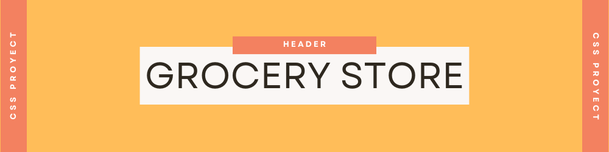
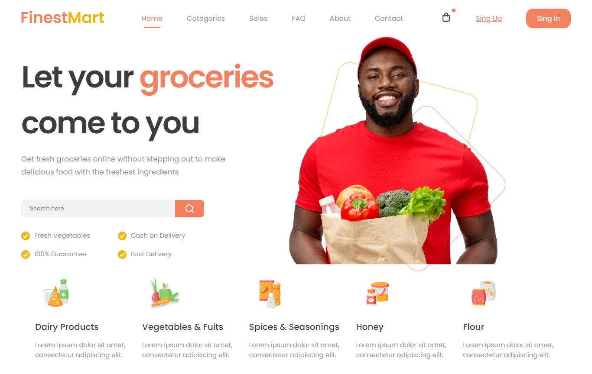

## Description
This project presents a practice header web page design employing CSS techniques such as flexbox and font imports. It encompasses various sections, including a header with navigational links, a hero section featuring engaging content, and a visually appealing list of items.

## Project Structure

- **index.html**: Houses the HTML structure of the webpage, defining the layout and content.

- **styles.css**: Primary CSS file defining the styles of the page, incorporating flexbox for layout structuring.
Defines visual aspects like font families, colors, and spacing.

## Live Preview 

  

## Open to work

I´m open to freelance web design projects for individuals or companies. Whether you need help with designing a new website or revamping an existing one, I am here to assist you. 

